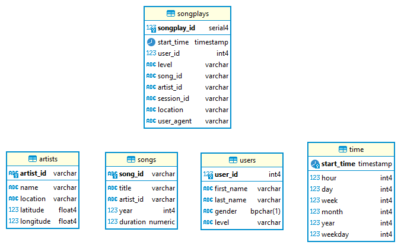

# Sparkify Data Modelling and ETL using Postgres

## Motivation

The startup, Sparkify, is a music streaming app and wants to analyse what songs their users are listening to. Their current data is available as local JSON files and cannot be easily analised. The purpose of the ETL process is to create a data model, process the JSON data in the files and load into a Postgres database.

## Data model

Data was normalized into a start schema with fact and dimention tables in order to use data for the analysis but also reuse data for future analysis.

## File descriptions

- `create_tables.py`: Connects to Postgres database, drops existing database, create an empty database and required tables.
- `sql_queries.py`: Contains all the SQL queries used to setup the database as well as processing the data.
- `etl.py`: Load JSON files (song and log files), process data and load into database.

**NOTE: Need to run `create_tables.py` before running `etl.py`.**

## How to run the files and notebooks

Dependencies and virtual environment details are located in the `Pipfile` which can be used with `pipenv`.

## License

GNU GPL v3

## Author

Coenraad Pretorius
